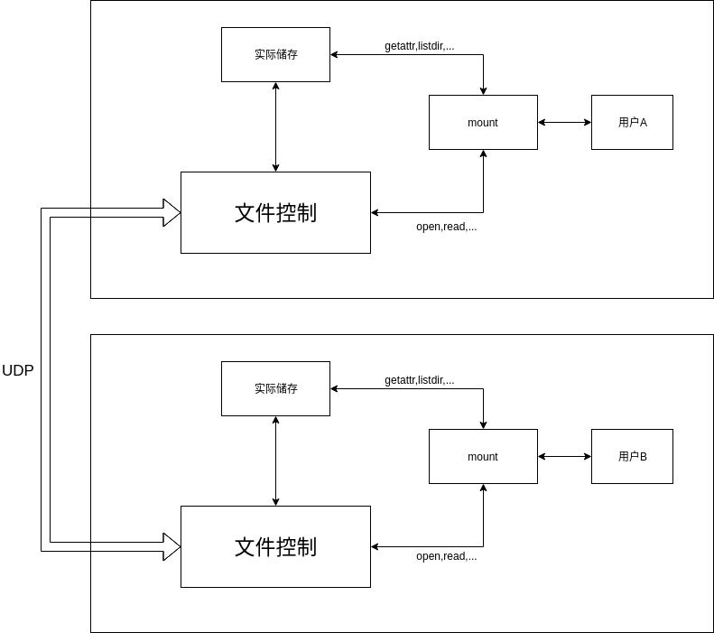
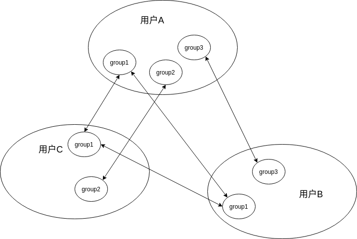

# 局域网共享网盘 作业报告

2015011343 陈宇 计54

2015011334 徐毅 计54

2015011324 欧阳前宇 计54

2015011318 寇明阳 计54

## 实现功能

1. 文件加密，只有具有正确密钥的用户才能够访问
2. 文件共享，同一个局域网内具有相同密钥的用户可以互传文件
3. 用户可以拥有多个密钥，用不同的密钥加密不同的文件
4. **无主机结构，网络中每个节点地位相等，没有网络的情况下也能够工作**

## 环境相关

* Fuse 3.2.3
* Ubuntu 16.04

## 安装&运行

### 编译

1. 按照`https://github.com/libfuse/libfuse`上的内容安装`libfuse`。

2. 在项目目录中运行`git submodule update --init --recursive`安装子模块

3. 运行`make`编译文件

### 运行

首先需要准备4个目录：

```sh
> mkdir mount mount2 real real2
```

然后可以运行我们的项目：

```sh
> make run
> make run2
```

此时，已经将我们的项目挂在到了`mount`和`mount2`上，`mount`和`mount2`中各有一个子目录，该子目录中的内容将会被加密并同步。

## 实现细节

### 框架说明

我们项目的整体框架大致可以用如下图片说明：

<div align="center"></div>

### 一。使用fuse实现一个虚拟磁盘

在实现我们想要功能的过程中，为了实现简单，我们借鉴了passthrough的思想，对于虚拟磁盘中的一个文件，在另一个文件夹(真实文件夹)中相对路径相同的地方存在一个**大小相同**的文件，对于虚拟文件的许多访问操作（比如`getattr`,`listdir`等）都会被转接到真实文件上。

考虑到加密功能的实现，真实文件并不存储真实的文件内容，而是存储加密之后的内容。对于需要获取文件内容的操作(比如`read`)，先通过我们的代码将真实文件解密，然后根据读取的数据区间返回内容。

比如`getattr`的实现代码如下：

```c++
static int xmp_getattr(const char *path, struct stat *stbuf,
		       struct fuse_file_info *fi)
{
	(void) fi;
	int res;

	control->Sync(path); // 将必要内容同步（比如文件大小）到真实文件上
	res = lstat(control->Resolve(path).c_str(), stbuf); // Resolve函数将相对路径换成真实文件的路径
	if (res == -1)
		return -errno;
	if (control->FindFile(path)) stbuf->st_mtime = control->FindFile(path)->timestamp; // 修改stbuf的“文件修改时间”

	return 0;
}
```

### 二。磁盘加密

我们的项目在设计之初，就考虑到了网络隔离，为此我们设计了组的概念：

1. 每一个文件组对应一个密钥
2. 具有相同文件组并且是相同密钥的用户才能够共享文件

<div align="center"></div>

所以，我们在虚拟磁盘的根目录创建了若干文件夹，每个文件夹的名称和组名相同，并且这些文件夹无法修改和删除，在根文件夹下也无法创建其他文件或文件夹。

对于某个文件，通过判断其属于哪个顶层文件夹就可以判断其所属的那个组，相应的可以确定有哪个密钥进行加密。

对于加密，我们选择的是`AES`对文件加密，每个密钥是一个字符串，通过用户在设置用户组的同时一起传递给程序。我们选用的`AES`加密算法要求密钥必须是128位的，所以我们首先需要做的就是将字符串的密钥转化为128位格式的密钥：

```c++
struct SecretKey
{
    uint8_t key[32];
};
SecretKey string2secret(string secret_key)
{
    SecretKey ans;
    memset(&ans, 0, sizeof(ans));

    while(secret_key.length() < sizeof(ans)) secret_key += secret_key;
    for(int i = 0; i < (int)secret_key.length(); i ++) {
        ans.key[i%sizeof(ans)] ^= (uint8_t)secret_key[i];
    }

    return ans;
}
```

其次，`AES`算法还要求被加密的内容长度必须为16字节的倍数，考虑到我们在储存文件的时候使用了passthrough的思想，所以我们实际存储的文件大小必须和用户想要储存的文件大小相同(`getattr`等函数需要获取文件大小)。

我们的解决办法是再创建一个全局的配置文件，该配置文件中储存每个文件对应的信息，包括文件名，是否被删除，额外的数据内容（16字节对齐）。在解密文件的时候连同配置文件中的对齐数据一起解密。

### 三。局域网同步

由于我们需要和局域网内所有安装有我们软件的用户进行同步，并且没有主机Server，在离线的情况下也可以使用，**所以我们最终决定使用UDP广播进行通信**。

在我们的项目中，网络传输分为两层：A层负责网络传输，加密，校验等，B层负责磁盘协议。

A层，负责发送和传输一个数据包，并且保证数据的正确性和完整性，还要求对数据进行校验和加密，实际的数据包结构如下：

| MessageHead | encrypted MessageHead | encrypted 16bytes-aligned payload |

如上，首先是一个消息头描述基本信息，第二部分是用`AES`加密消息头之后数据，主要用于验证发送人的密钥是否正确。第三部分则是我们要发送的主要数据，由于`AES`加密要求数据长度为16字节的倍数，所以实际发送的数据可能比需要发送的数据更长，在`MessageHead`中分别记录了对齐之前和对齐之后的长度：

```c++
struct MessageHead
{
    uint32_t version; // must be 1
    uint32_t time;
    uint32_t payload_real_length;
    uint32_t payload_total_length;
};
```

在B层，则是广播磁盘相关的数据，必须文件删除与更新等，具体到每个操作有不同的格式要求，在此不一一说明，以下是公共数据头：

```c++
const int32_t packet_type_online = 0;
const int32_t packet_type_modify = 1;
const int32_t packet_type_delete = 2;

struct PacketHead
{
    int32_t type;
    int32_t time;
    char filename[FILENAME_MAX_SIZE];
};
```

在我们的设计中，用户一上线就会向其他人（包括自己）广播其上线消息，其他人在收到上线消息之后会将自己目录中的所有文件数据发送出去，用这种方式实现文件的初始同步。

### 四。文件缓存

在我们的项目中使用了`AES`加密和解密，但是`AES`加密和解密都非常耗时，由于我们的实现不够巧妙，每次读取文件都需要先将文件解密，造成了磁盘性能的大幅度下降，所以我们在程序中加入了文件缓存，缓存中储存了对应文件的明文数据，这样在频繁读文件的时候就可以直接从内存中拷贝，而不需要重新解密。

同时，我们还需要在必要的时候将缓存中的数据同步到磁盘上，比如前文提到的`getattr`操作。

另外，为了避免缓存太多消耗资源，我们的代码中还启用了一个线程不断的检查文件缓存是否过期。在我们的设计中，如果2秒之后缓存中有“脏”的数据，就会被同步到磁盘上，在30秒之内存在没有被访问缓存则会被删除。

缓存相关的存储数据如下：

```c++
map<string, time_t> last_hit;
map<string, time_t> last_modify;
map<string, data_t> file_cache;
map<string, bool> is_dirty;
```

## 遗留问题

在项目开始之初，为了实现简单我们借鉴了passthrough的实现方式，但是没有考虑到`AES`加密和解密非常费事。

我们认为，正确做法应该是将文件分快存储，这样在加密解密的时候就只用处理一小快，可以大大减少时间消耗。

## 遇到的问题和解决方案

### udp丢包严重

经过计算，在tsinghua校园网的情况下，丢包率大概是25%，这样就导致一个图片传输之后会有很严重的缺失。

我们采用了重传的思路，每个文件包发5遍，这样根据概率计算，丢包率会下降到千分之一。
